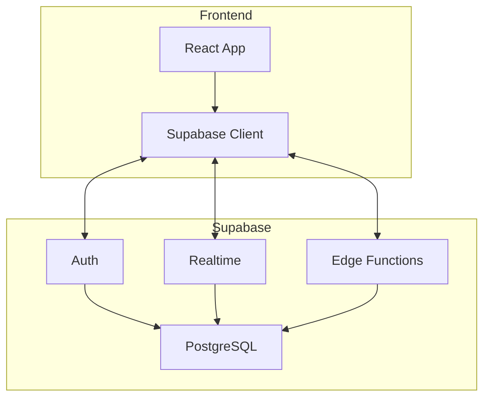

# Przewodnik po Skillach i Agentach Claude Code

## Spis treści
1. [Quick Reference](#quick-reference)
2. [Wprowadzenie](#wprowadzenie)
3. [Memory Bank - Fundament systemu](#memory-bank---fundament-systemu)
4. [Cykl SDLC - Przepływ pracy](#cykl-sdlc---przepływ-pracy)
5. [Skille (Komendy)](#skille-komendy)
   - [/setup-project](#setup-project)
   - [/first-prompt](#first-prompt)
   - [/setup-tests](#setup-tests)
   - [/manual-test](#manual-test)
   - [/commit](#commit)
   - [/handoff](#handoff)
   - [/standup](#standup)
   - [/teacher](#teacher)
   - [/pm](#pm)
6. [Agenci](#agenci)
   - [quick-lint](#quick-lint)
   - [code-reviewer](#code-reviewer)
   - [test-case-generator](#test-case-generator)
   - [memory-bank-sync](#memory-bank-sync)
   - [dep-analyzer](#dep-analyzer)
   - [adr-generator](#adr-generator)
7. [Najlepsze praktyki](#najlepsze-praktyki)
8. [Rozwiązywanie problemów](#rozwiązywanie-problemów)

---

## Quick Reference

### Skille

| Komenda | Cel | Etap SDLC |
|---------|-----|-----------|
| `/setup-project [mcp]` | Inicjalizacja projektu, Memory Bank, MCP | Planowanie |
| `/first-prompt` | Szkielet aplikacji React/Vite | Implementacja |
| `/setup-tests` | Konfiguracja Vitest + Testing Library | Testowanie |
| `/manual-test [scope]` | Generowanie testów QA, auto-testy Chrome | Testowanie |
| `/commit` | Code review + commit + ClickUp sync | Przegląd |
| `/handoff` | Dokumentacja przekazania projektu | Przekazanie |
| `/standup` | Raport daily standup z Git/ClickUp | Przekazanie |
| `/teacher [--quick\|--deep]` | Tryb edukacyjny | Implementacja |
| `/pm <cmd>` | Zarządzanie ClickUp | Wszystkie |

### Agenci

| Agent | Zadanie | Trigger |
|-------|---------|---------|
| `quick-lint` | TypeScript errors + secrets scan | Auto przed commit |
| `code-reviewer` | SOLID/KISS/DRY/YAGNI compliance | Po zmianach kodu |
| `test-case-generator` | Generowanie przypadków testowych | Po nowej funkcji |
| `memory-bank-sync` | Synchronizacja dokumentacji | Po commitach |
| `dep-analyzer` | npm audit, bundle size, licenses | Po npm install |
| `adr-generator` | Architecture Decision Records | Po decyzjach tech |

---

## Wprowadzenie

System skilli i agentów Claude Code wspiera rozwój projektu zgodnie z zasadami:

- **TDD** - Red-Green-Refactor, testy przed kodem
- **SOLID** - Single Responsibility, Open/Closed, Liskov, Interface Segregation, Dependency Inversion
- **KISS** - prostota ponad złożonością
- **DRY** - eliminacja duplikacji
- **YAGNI** - implementuj tylko to, co potrzebne teraz

### Skille vs Agenci

**Skille** - komendy wywoływane explicite przez `/nazwa`:
```
/commit
/manual-test full
/pm status
```

**Agenci** - procesy uruchamiane automatycznie lub przez Claude w odpowiednich momentach. Działają w tle, wykonują specjalistyczne zadania.

---

## Memory Bank - Fundament systemu

Memory Bank przechowuje kontekst projektu między sesjami Claude. Po resecie pamięci, Claude opiera się WYŁĄCZNIE na tych plikach.

```
memory-bank/
├── handbook.md        # Reguły projektu, workflow (czytaj PIERWSZY)
├── projectbrief.md    # Cele, zakres, wymagania funkcjonalne
├── techContext.md     # Stack, architektura, zależności
├── productContext.md  # Kontekst biznesowy, persony użytkowników
├── systemPatterns.md  # Wzorce projektowe, konwencje kodowania
├── activeContext.md   # AKTUALNY stan pracy (aktualizuj często)
├── progress.md        # Historia zmian, kamienie milowe
└── integrations/      # Konfiguracje MCP (ClickUp, Netlify, etc.)
```

| Plik | Aktualizacja |
|------|--------------|
| `handbook.md` | Rzadko - tylko fundamentalne zmiany |
| `projectbrief.md` | Początek projektu |
| `techContext.md` | Przy zmianach stacku/architektury |
| `productContext.md` | Przy zmianach produktowych |
| `systemPatterns.md` | Przy nowych wzorcach |
| `activeContext.md` | Każda sesja - bieżący stan |
| `progress.md` | Po każdej znaczącej zmianie |

> **Zasada:** Claude ZAWSZE zaczyna sesję od przeczytania `handbook.md`

---

## Cykl SDLC - Przepływ pracy

```
┌─────────────────────────────────────────────────────────────────┐
│                         CYKL SDLC                               │
├─────────────────────────────────────────────────────────────────┤
│                                                                 │
│  1. PLANOWANIE          2. IMPLEMENTACJA      3. TESTOWANIE    │
│  ┌─────────────┐        ┌──────────────┐      ┌─────────────┐  │
│  │/setup-project│   ──▶ │/first-prompt │  ──▶ │/setup-tests │  │
│  │/pm setup    │        │/teacher      │      │/manual-test │  │
│  └─────────────┘        └──────────────┘      └─────────────┘  │
│         │                      │                    │          │
│         ▼                      ▼                    ▼          │
│  4. PRZEGLĄD            5. WDROŻENIE          6. PRZEKAZANIE   │
│  ┌─────────────┐        ┌──────────────┐      ┌─────────────┐  │
│  │/commit      │   ◀──  │  Deployment  │  ──▶ │/handoff     │  │
│  │code-reviewer│        │              │      │/standup     │  │
│  └─────────────┘        └──────────────┘      └─────────────┘  │
│                                                                 │
└─────────────────────────────────────────────────────────────────┘
```

---

## Skille (Komendy)

### /setup-project

Inicjalizacja projektu z Memory Bank, Git i konfiguracją MCP.

**Składnia:**
```bash
/setup-project [argument]
```

**Argumenty:**

| Argument | Opis |
|----------|------|
| *(brak)* | Pełna konfiguracja projektu |
| `supabase` | Tylko konfiguracja Supabase MCP |
| `context7` | Tylko konfiguracja Context7 MCP |
| `netlify` | Tylko konfiguracja Netlify MCP |
| `clickup` | Tylko konfiguracja ClickUp MCP |

**Przykłady:**
```bash
# Nowy projekt - pełna inicjalizacja
/setup-project
# -> Claude utworzy memory-bank/, .mcp.json, zainicjalizuje Git
# -> Interaktywnie zapyta o konfigurację MCP

# Istniejący projekt - dodanie Supabase
/setup-project supabase
# -> Skonfiguruje tylko Supabase MCP, nie nadpisze istniejącego Memory Bank

# Późniejsze dodanie ClickUp
/setup-project clickup
# -> Można uruchamiać wielokrotnie z różnymi argumentami
```

**Co robi:**
1. Sprawdza istniejącą strukturę projektu
2. Tworzy folder `memory-bank/` z szablonami plików
3. Inicjalizuje Git (jeśli nie istnieje)
4. Interaktywnie konfiguruje wybrane serwery MCP
5. Tworzy/aktualizuje `.mcp.json`

**Uwagi:**
- Komenda jest bezpieczna - nie nadpisze istniejącego Memory Bank
- Przygotuj klucze API przed uruchomieniem (Supabase URL/Key, ClickUp token, etc.)
- Można dodawać kolejne integracje MCP w dowolnym momencie

**Wymagania:**
- Istniejący folder projektu
- Klucze API dla serwerów MCP (opcjonalne)

---

### /first-prompt

Implementacja szkieletu aplikacji React/Vite po konfiguracji projektu.

**Składnia:**
```bash
/first-prompt
```

**Przykład:**
```bash
# Po zakończeniu /setup-project i wypełnieniu projectbrief.md
/first-prompt
# -> Claude przeczyta Memory Bank
# -> Stworzy strukturę src/pages/, src/components/
# -> Zaimplementuje podstawowe komponenty
# -> Skonfiguruje React Router
# -> Zaktualizuje progress.md
```

**Co robi:**
1. Czyta Memory Bank (`projectbrief.md`, `techContext.md`)
2. Tworzy strukturę folderów (`src/`, `src/components/`, `src/pages/`)
3. Implementuje podstawowe komponenty i strony
4. Konfiguruje routing
5. Aktualizuje Memory Bank z postępem

**Uwagi:**
- Uruchom **tylko raz** po `/setup-project`
- Upewnij się, że `projectbrief.md` jest kompletny - Claude użyje go do generowania
- Tworzy minimalny szkielet - rozbudowuj stopniowo
- Dodatkowe strony/komponenty dodawaj ręcznie lub przez standardowe prompty

**Wymagania:**
- Ukończony `/setup-project`
- Wypełniony `memory-bank/projectbrief.md`
- Node.js i npm zainstalowane

---

### /setup-tests

Konfiguracja infrastruktury testowej Vitest zgodnej z TDD.

**Składnia:**
```bash
/setup-tests
```

**Co robi:**
1. Instaluje zależności: `vitest`, `@testing-library/react`, `@testing-library/jest-dom`, `jsdom`
2. Tworzy `vitest.config.ts` z konfiguracją JSDOM
3. Tworzy `src/test/setup.ts` z globalnymi matcherami
4. Generuje przykładowe testy dla istniejących komponentów
5. Dodaje skrypty do `package.json`:
   - `test` - jednorazowe uruchomienie
   - `test:watch` - tryb ciągły
   - `test:coverage` - raport pokrycia
6. Aktualizuje Memory Bank

**Po instalacji:**
```bash
npm run test        # Jednorazowe uruchomienie
npm run test:watch  # Tryb ciągły (ZALECANE podczas pracy)
npm run test:coverage
```

**Cykl TDD:**
```
┌─────────────────────────────────────────────────────────┐
│   1. RED            2. GREEN          3. REFACTOR       │
│   ┌─────────┐       ┌─────────┐       ┌─────────┐      │
│   │ Napisz  │  ──▶  │ Napisz  │  ──▶  │ Oczyść  │      │
│   │ FAILING │       │ MINIMAL │       │ kod     │      │
│   │ test    │       │ code    │       │         │      │
│   └─────────┘       └─────────┘       └─────────┘      │
│        ▲                                    │          │
│        └────────────────────────────────────┘          │
└─────────────────────────────────────────────────────────┘
```

**Uwagi:**
- Uruchom **przed** implementacją logiki biznesowej - TDD wymaga testów najpierw
- Używaj `npm run test:watch` podczas kodowania - natychmiastowy feedback
- Testy mogą być w `src/__tests__/` lub jako `*.test.ts` obok plików źródłowych
- Przestrzegaj cyklu RED-GREEN-REFACTOR

**Wymagania:**
- Projekt Node.js z `package.json`
- Ukończone `/setup-project` i `/first-prompt`

---

### /manual-test

Generowanie przypadków testowych do weryfikacji QA - manualnej lub automatycznej przez Chrome.

**Składnia:**
```bash
/manual-test [argument]
```

**Argumenty:**

| Argument | Opis |
|----------|------|
| *(brak)* lub `recent` | Testowanie ostatnich zmian (staged, unstaged, lub ostatni commit) |
| `full` lub `e2e` | Pełne testowanie E2E całej aplikacji |
| `<feature>` | Testowanie konkretnej funkcjonalności (np. `login`, `checkout`) |
| `auto` | Automatyczne testy w Chrome (ostatnie zmiany) |
| `auto full` | Automatyczne pełne E2E w Chrome |
| `--help`, `-h` | Wyświetlenie pomocy |

**Przykłady:**
```bash
# Przed commitem - testuj ostatnie zmiany
/manual-test
# -> Claude analizuje git diff/status
# -> Generuje przypadki testowe z krokami
# -> Ty wykonujesz testy, oznaczasz [x] PASS lub [!] FAIL

# Przed release'em - pełne E2E (OBOWIĄZKOWE)
/manual-test full
# -> Kompletny przepływ przez całą aplikację

# Testowanie konkretnej funkcji
/manual-test login
# -> Skupione testy tylko na logowaniu

# Automatyczne testy w Chrome
/manual-test auto
# -> Wymaga rozszerzenia Chrome Claude
# -> Claude sam nawiguje i testuje w przeglądarce
```

**Tryby pracy:**

**Tryb manualny (domyślny):**
1. Claude analizuje zmiany w Git
2. Kategoryzuje zmienione pliki (UI, API, logika)
3. Generuje przypadki testowe z krokami i oczekiwanymi rezultatami
4. Developer uruchamia `npm run dev`
5. Developer wykonuje testy ręczne
6. Developer oznacza wyniki: `[x] PASS` lub `[!] FAIL`
7. Claude dokumentuje rezultaty

**Tryb automatyczny (`auto`):**
```bash
# 1. Uruchom Claude z Chrome
claude --chrome

# 2. Sprawdź połączenie
/chrome

# 3. Uruchom testy
/manual-test auto
# -> Claude nawiguje w Chrome
# -> Wykonuje testy automatycznie
# -> Robi screenshoty przy błędach
# -> Raportuje wyniki w real-time
```

**Kategorie generowanych testów:**
- **Happy path** - standardowy przepływ użytkownika
- **Walidacja inputów** - puste, błędne dane, edge cases
- **Stany UI** - loading, empty, error, success
- **Interakcje** - buttony, linki, formularze, modale
- **Responsywność** - desktop, tablet, mobile
- **Dostępność** - nawigacja klawiaturą, kontrast
- **Bezpieczeństwo** - XSS, autoryzacja, walidacja danych

**Co generuje:**
- Przypadki testowe z krokami i oczekiwanymi rezultatami
- Checklist DevTools (co sprawdzić w konsoli/network)
- Szablon bug reportu
- Podsumowanie testów z rekomendacjami

**Kiedy używać:**

| Sytuacja | Komenda | Priorytet |
|----------|---------|-----------|
| Przed release'em | `/manual-test full` | **OBOWIĄZKOWE** |
| Po większej funkcjonalności | `/manual-test` | Zalecane |
| Szybka weryfikacja | `/manual-test auto` | Opcjonalne |
| Konkretna funkcja | `/manual-test login` | Wg potrzeb |

**Wymagania dla trybu auto:**
- Chrome z rozszerzeniem Claude (v1.0.36+)
- Claude Code CLI v2.0.73+ (`claude update`)
- Płatny plan Claude (Pro/Team/Enterprise)
- Chrome uruchomiony i widoczny (nie headless)

---

### /commit

Przegląd kodu, staging i commit z integracją ClickUp.

**Składnia:**
```bash
/commit
```

**Co robi:**
1. Wykonuje `git status` i `git diff` - analiza zmian
2. Uruchamia `quick-lint` - TypeScript errors, secrets scan
3. Sprawdza zgodność z CLAUDE.md (SOLID, KISS, DRY)
4. Generuje commit message w formacie Conventional Commits
5. Prezentuje podsumowanie do zatwierdzenia
6. Staguje pliki i wykonuje commit
7. Opcjonalnie: aktualizuje zadanie w ClickUp

**Format commit message:**
```
<type>(<scope>): <description>

[optional body - szczegóły zmian]

[optional footer - breaking changes, issue refs]
```

**Typy commitów:**

| Typ | Opis | Przykład |
|-----|------|----------|
| `feat` | Nowa funkcjonalność | `feat(auth): add login form` |
| `fix` | Naprawa błędu | `fix(api): handle timeout errors` |
| `docs` | Dokumentacja | `docs: update README` |
| `style` | Formatowanie (bez zmian logiki) | `style: fix indentation` |
| `refactor` | Refaktoryzacja | `refactor(utils): extract validation` |
| `test` | Testy | `test(auth): add login tests` |
| `chore` | Zadania pomocnicze | `chore: update dependencies` |

**Przykład:**
```bash
/commit
# Claude: Analizuje zmiany...
#
# === COMMIT SUMMARY ===
# Files changed: 3
# Insertions: +45, Deletions: -12
#
# Proposed message:
# feat(dashboard): add estimate filtering
#
# - Add status filter buttons (All/Draft/Approved)
# - Implement search by estimate name
# - Add empty state component
#
# Quick Lint: PASSED
# Code Review: No blocking issues
#
# Proceed with commit? [Y/n]
```

**Integracja z ClickUp:**
Jeśli masz skonfigurowany ClickUp MCP:
- Automatycznie linkuje commit do aktywnego zadania
- Aktualizuje status zadania (opcjonalnie)
- Dodaje komentarz z opisem zmian

**Uwagi:**
- Commituj często, małymi porcjami - łatwiej przeglądać i cofać
- **NIGDY** nie commituj sekretów (klucze API, hasła, tokeny)
- Jeśli zmiany są zbyt duże - podziel na mniejsze, logiczne commity
- Przy większych zmianach rozważ `/manual-test` przed commitem

---

### /handoff

Przygotowanie projektu do przekazania innemu developerowi.

**Składnia:**
```bash
/handoff
```

**Co generuje:**

1. **Podsumowanie projektu** - cel, stack technologiczny, architektura
2. **Aktualny stan** - co działa, co jest w trakcie
3. **Niedokończone zadania** - lista TODO z priorytetami
4. **Znane problemy** - bugi, ograniczenia, workaroundy
5. **Instrukcje uruchomienia** - krok po kroku
6. **Kontekst dla AI** - jak kontynuować pracę z Claude

**Przykład wyjścia:**
```markdown
# Handoff: Projekt Wyceniator

## Stan na: 2025-01-05

### Podsumowanie
AI-powered project estimation tool.
Stack: React 19 + Vite 7 + Supabase + TypeScript

### Co działa
- Logowanie użytkowników (restrykcja @personit.net)
- Dashboard z listą estymacji
- Filtrowanie i wyszukiwanie
- Podstawowy layout z Header

### W trakcie
- [ ] Formularz tworzenia estymacji
- [ ] Eksport do PDF

### Niedokończone (backlog)
- [ ] Integracja z Jira
- [ ] Historia wersji estymacji
- [ ] Powiadomienia email

### Znane problemy
1. Brak walidacji formularza estymacji (TODO)
2. Animacje Framer Motion czasem lagują na mobile

### Jak kontynuować
1. Przeczytaj memory-bank/handbook.md
2. npm install && npm run dev
3. Skup się na formularzu estymacji (priorytet)
4. Testy: npm run test:watch
```

**Uwagi:**
- Uruchamiaj na koniec dnia pracy lub przed przekazaniem
- Zaktualizuj Memory Bank **przed** handoffem
- Bądź szczery w opisie problemów - to pomoże kolejnej osobie
- Dodaj kontekst, którego nie ma w kodzie (decyzje, workaroundy)

---

### /standup

Generowanie raportu daily standup z historii Git i ClickUp.

**Składnia:**
```bash
/standup
```

**Co analizuje:**
- Commity z ostatnich 24h (git log)
- Zadania w ClickUp (jeśli skonfigurowany)
- Aktualny stan z `activeContext.md`

**Format raportu:**
```markdown
# Daily Standup - 2025-01-05

## Co zrobiłem wczoraj
- feat: dodałam logowanie użytkowników z restrykcją domeny
- fix: naprawiłem walidację formularza
- test: dodałam testy dla LoginPage i AuthService
- chore: aktualizacja zależności (React 19.2)

## Co zrobię dzisiaj
- Implementacja formularza estymacji
- Code review PR #42
- Sync z Memory Bank

## Blokery
- Brak dostępu do API zewnętrznego (czekam na credentials)
```

**Uwagi:**
- Uruchamiaj rano, przed spotkaniem zespołu
- Claude generuje "wczoraj" z Git - "dzisiaj" i "blokery" uzupełnij ręcznie
- Możesz skopiować bezpośrednio do Slack/Teams/Jira

---

### /teacher

Tryb edukacyjny - Claude wyjaśnia kod, koncepcje i decyzje architektoniczne.

**Składnia:**
```bash
/teacher [--quick|--deep]
```

**Tryby:**

| Flaga | Opis | Użycie |
|-------|------|--------|
| *(brak)* | Standardowe wyjaśnienie | Ogólne pytania |
| `--quick` | Zwięzłe, 2-3 zdania | Przypomnienie koncepcji |
| `--deep` | Pełna analiza z przykładami i analogiami | Nauka nowych koncepcji |

**Przykłady:**
```bash
# Standardowe wyjaśnienie funkcji z projektu
/teacher
> Co robi funkcja calculateEstimate w src/utils/estimate.ts?
# Claude: Wyjaśni z kontekstem projektu, pokaże flow danych

# Szybkie przypomnienie
/teacher --quick
> Czym jest useEffect?
# Claude: Krótka definicja, 2-3 zdania

# Głęboka analiza wzorca
/teacher --deep
> Wyjaśnij wzorzec Repository używany w projekcie
# Claude:
# 1. Kontekst - gdzie w projekcie
# 2. Wyjaśnienie - co to jest, jak działa
# 3. Analogia - porównanie do czegoś znanego
# 4. Przykład - kod z komentarzami
# 5. Pytanie sprawdzające - czy zrozumiałeś?
```

**Metodologia nauczania (tryb `--deep`):**
1. **Kontekst** - osadzenie w projekcie, gdzie używane
2. **Wyjaśnienie** - jasny, techniczny opis koncepcji
3. **Analogia** - porównanie do czegoś ze świata rzeczywistego
4. **Przykład** - kod z projektu lub nowy, z komentarzami
5. **Weryfikacja** - pytanie sprawdzające zrozumienie

**Uwagi:**
- `--quick` gdy znasz podstawy, potrzebujesz szybkiego przypomnienia
- `--deep` przy nowych koncepcjach lub złożonych wzorcach
- Pytaj o "dlaczego" (decyzje), nie tylko "co" (fakty)
- Jeśli nie rozumiesz - powiedz, Claude wyjaśni inaczej

---

### /pm

Integracja z ClickUp - zarządzanie zadaniami z poziomu CLI.

**Składnia:**
```bash
/pm <subcommand> [options]
```

**Subkomendy:**

| Subcommand | Opis |
|------------|------|
| `setup` | Konfiguracja ClickUp - wybór workspace, space, list |
| `task` | Tworzenie nowego zadania |
| `bug` | Zgłaszanie błędu (z szablonem bug report) |
| `doc` | Tworzenie dokumentacji |
| `help-request` | Prośba o pomoc/review |
| `status` | Przegląd statusu projektu - zadania, postęp |
| `sync` | Synchronizacja Memory Bank z ClickUp |
| `resolve` | Rozwiązanie zadania/buga |

**Przykłady:**
```bash
# Pierwsza konfiguracja
/pm setup
# -> Claude zapyta o workspace, space, listy
# -> Zapisze konfigurację w memory-bank/integrations/clickup.md

# Nowe zadanie
/pm task
> Implementacja eksportu PDF z estymacjami
# -> Claude utworzy task w ClickUp z opisem, tagami

# Zgłoszenie buga
/pm bug
> Timeout przy dużych projektach (>100 tasków)
# -> Claude utworzy bug report z szablonem (steps to reproduce, expected, actual)

# Status projektu
/pm status
# -> Pokaże zadania TO DO, IN PROGRESS, blokery, statystyki

# Synchronizacja
/pm sync
# -> Zaktualizuje ClickUp na podstawie progress.md
# -> Zaktualizuje Memory Bank na podstawie ClickUp

# Zamknięcie zadania
/pm resolve
# -> Oznaczy aktywny task jako DONE
# -> Opcjonalnie doda komentarz z podsumowaniem
```

**Przepływ zadania:**
```
/pm task ──▶ TO DO ──▶ IN PROGRESS ──▶ /pm resolve ──▶ DONE
                           │
                    /commit linkuje
                     do tego taska
```

**Uwagi:**
- Uruchom `/pm setup` przed pierwszym użyciem
- `/pm status` - dobry start dnia, przegląd co do zrobienia
- `/pm sync` - uruchamiaj codziennie dla spójności
- Commity automatycznie linkowane do aktywnego zadania

**Wymagania:**
- Konto ClickUp z uprawnieniami
- Skonfigurowany ClickUp MCP (`/setup-project clickup`)
- Utworzony workspace i listy w ClickUp

---

## Agenci

Agenci to automatyczne procesy uruchamiane przez Claude w odpowiednich momentach lub na żądanie.

### quick-lint

Szybka weryfikacja TypeScript i skanowanie sekretów.

**Kiedy się uruchamia:**
- Automatycznie przed `/commit`
- Przy zapisie plików (opcjonalnie, w zależności od konfiguracji)
- Na żądanie

**Co sprawdza:**

| Check | Metoda | Blocking |
|-------|--------|----------|
| TypeScript | `npx tsc --noEmit` | Tak |
| Sekrety | Pattern matching | Tak |

**Wzorce sekretów:**
- AWS credentials: `AKIA[0-9A-Z]{16}`
- Private keys: `-----BEGIN.*PRIVATE KEY-----`
- Hasła w kodzie: `password\s*[:=]\s*['"][^'"]+['"]`
- Tokeny: `token\s*[:=]\s*['"][^'"]+['"]`
- Connection strings: `postgres://`, `mysql://`, `mongodb://`

**Przykład wyjścia:**
```
QUICK LINT: PASSED
------------------
TypeScript: OK (0 errors)
Secrets: OK (none found)
Time: 3.2s
```

```
QUICK LINT: ISSUES FOUND
------------------------
TypeScript: 2 errors
  - src/utils.ts:45 - Property 'name' does not exist on type
  - src/api.ts:12 - Cannot find module '@/types'

Secrets: BLOCKED
  - src/config.ts:12 - Possible API key detected

Fix these before committing!
```

**Uwagi:**
- **NIGDY** nie ignoruj ostrzeżeń o sekretach - przenoś do `.env`
- Fałszywe pozytywy dodaj do `.lintignore`
- Target: <5 sekund na pełne sprawdzenie

---

### code-reviewer

Przegląd kodu zgodnie z zasadami CLAUDE.md.

**Kiedy się uruchamia:**
- Automatycznie przed `/commit`
- Po znaczących zmianach kodu
- Na żądanie

**Kryteria oceny:**

| Zasada | Sprawdzenie |
|--------|-------------|
| SOLID | Czy klasy mają jedną odpowiedzialność? Open/Closed? |
| KISS | Czy kod jest prosty? Brak over-engineeringu? |
| DRY | Czy nie ma duplikacji kodu? |
| YAGNI | Czy nie ma funkcji "na przyszłość"? |
| TDD | Czy są testy dla nowego kodu? |
| Security | Czy kod jest bezpieczny? Brak XSS, injection? |

**Przykład wyjścia:**
```
CODE REVIEW SUMMARY
-------------------
Files reviewed: 4
Issues found: 2 blocking, 3 suggestions

BLOCKING:
- [DRY] src/pages/LoginPage.tsx:45 - Duplikacja walidacji email
  Sugestia: Wydziel do src/utils/validation.ts

- [TDD] src/services/EstimateService.ts - Brak testów dla nowej funkcji

SUGGESTIONS:
- [SOLID] src/services/UserService.ts - Rozważ wydzielenie AuthService
- [KISS] src/components/Dashboard.tsx:89 - Można uprościć logikę filtrowania

PASSED:
- Type safety
- No hardcoded secrets
- Consistent naming
```

**Uwagi:**
- BLOCKING issues muszą być naprawione przed commitem
- Sugestie rozważ - nie wszystkie muszą być wdrożone
- Dyskutuj z zespołem przy wątpliwościach

---

### test-case-generator

Generowanie przypadków testowych dla funkcji i komponentów.

**Kiedy się uruchamia:**
- Po implementacji nowej funkcji
- Na żądanie

**Co generuje:**
- **Happy path** - standardowe, poprawne użycie
- **Edge cases** - wartości brzegowe (0, max, min, empty)
- **Error cases** - obsługa błędów, wyjątków
- **Null/undefined** - wartości puste
- **Type coercion** - nieoczekiwane typy danych

**Przykład wyjścia:**
```typescript
// Generated tests for calculateDiscount(price: number, percent: number)

describe('calculateDiscount', () => {
  // === HAPPY PATH ===
  it('should calculate 10% discount on 100', () => {
    expect(calculateDiscount(100, 10)).toBe(90);
  });

  it('should calculate 50% discount on 200', () => {
    expect(calculateDiscount(200, 50)).toBe(100);
  });

  // === EDGE CASES ===
  it('should handle 0% discount', () => {
    expect(calculateDiscount(100, 0)).toBe(100);
  });

  it('should handle 100% discount', () => {
    expect(calculateDiscount(100, 100)).toBe(0);
  });

  it('should handle price of 0', () => {
    expect(calculateDiscount(0, 10)).toBe(0);
  });

  // === ERROR CASES ===
  it('should throw on negative price', () => {
    expect(() => calculateDiscount(-100, 10)).toThrow('Price must be positive');
  });

  it('should throw on discount > 100', () => {
    expect(() => calculateDiscount(100, 150)).toThrow('Discount cannot exceed 100%');
  });
});
```

**Uwagi:**
- Przejrzyj wygenerowane testy - dostosuj do specyfiki projektu
- Dodaj testy dla logiki biznesowej, której agent nie zna
- Traktuj jako punkt wyjścia, nie gotowy produkt

---

### memory-bank-sync

Synchronizacja plików Memory Bank z aktualnym stanem projektu.

**Kiedy się uruchamia:**
- Po commitach (zalecane)
- Na koniec sesji pracy
- Przed handoffem
- Na żądanie

**Co synchronizuje:**

| Plik | Sprawdzenie |
|------|-------------|
| `activeContext.md` | Czy odzwierciedla aktualny stan pracy? |
| `progress.md` | Czy zawiera ostatnie zmiany? |
| `techContext.md` | Czy package.json zgadza się z dokumentacją? |
| `systemPatterns.md` | Czy nowe wzorce są udokumentowane? |

**Drift detection - szuka:**
- Nowych plików/folderów nie udokumentowanych
- Zależności w package.json nie opisanych w techContext
- Ukończonych funkcji nie odnotowanych w progress.md
- Nowych wzorców/konwencji nie udokumentowanych

**Przykład wyjścia:**
```
MEMORY BANK SYNC STATUS
-----------------------
Last synced: 2025-01-04 18:30
Current state: DRIFT_DETECTED

DRIFT DETECTED:
1. [HIGH] progress.md - Missing: PDF export feature completion
2. [HIGH] techContext.md - New dependency: puppeteer (not documented)
3. [MED] systemPatterns.md - New pattern: Repository (not documented)
4. [LOW] activeContext.md - Outdated work focus

RECOMMENDED ACTIONS:
- Update progress.md with PDF export completion
- Add puppeteer to techContext.md dependencies
- Document Repository pattern in systemPatterns.md

AUTO-UPDATE CANDIDATES:
- activeContext.md (safe to auto-update)
- progress.md (safe to auto-update)

MANUAL REVIEW REQUIRED:
- techContext.md (verify accuracy)
- systemPatterns.md (confirm pattern description)
```

**Uwagi:**
- Uruchamiaj minimum raz dziennie
- Szczególnie ważne przed handoffem lub dłuższą przerwą
- Agent może auto-aktualizować `activeContext.md` i `progress.md`
- `techContext.md` i `systemPatterns.md` wymagają recenzji

---

### dep-analyzer

Analiza zależności npm - bezpieczeństwo, rozmiar, licencje.

**Kiedy się uruchamia:**
- Po `npm install` nowych pakietów
- Na żądanie (zalecane: minimum raz w tygodniu)

**Co analizuje:**

| Check | Metoda | Poziom |
|-------|--------|--------|
| Security | `npm audit --json` | BLOCKING (critical/high) |
| Bundle size | Analiza rozmiaru pakietu | Warning (>100KB gzipped) |
| Maintenance | npm registry API | Warning (>12 mies. bez update) |
| License | package.json license field | Notice (copyleft) |
| Duplicates | `npm ls` | Warning |
| Outdated | `npm outdated` | Info |

**Przykład wyjścia dla projektu:**
```
DEP ANALYZER: Project Dependencies
══════════════════════════════════════════════════════════════
Total: 406 packages (95 prod, 311 dev)

SECURITY:
  Status: PASSED (0 vulnerabilities)

BUNDLE SIZE (prod dependencies):
  framer-motion    ~150KB gzipped  [WARNING - large but justified for animations]
  react-dom        ~42KB gzipped   [OK]
  react-router-dom ~14KB gzipped   [OK]

MAINTENANCE:
  All packages actively maintained [OK]

LICENSES:
  MIT: 92 | Apache-2.0: 2 | ISC: 1
  No copyleft licenses detected [OK]

DUPLICATES:
  None detected [OK]

VERDICT: SAFE
══════════════════════════════════════════════════════════════
```

**Przykład dla konkretnego pakietu:**
```
DEP ANALYZER: lodash@4.17.15
════════════════════════════
Security:    CRITICAL - CVE-2021-23337 (Prototype Pollution)
Bundle Size: 72KB (gzipped: 25KB)
Last Update: 2021-02-20 (3+ years ago) [WARNING]
Downloads:   45M weekly [OK]
License:     MIT [OK]

VERDICT: NOT RECOMMENDED

ALTERNATIVES:
- lodash-es (tree-shakeable, 25KB vs 72KB)
- Native JS methods (Array.map, Object.assign, etc.)
- Individual lodash functions (lodash.get, lodash.merge)
```

**Uwagi:**
- Uruchamiaj regularnie - minimum raz w tygodniu
- CRITICAL/HIGH security issues - napraw natychmiast
- Testuj aplikację po aktualizacjach
- Nie aktualizuj wszystkiego naraz - inkrementalnie

---

### adr-generator

Generator Architecture Decision Records.

**Kiedy się uruchamia:**
- Przy wyborze technologii (baza danych, framework, biblioteka)
- Przy decyzjach architektonicznych (patterns, struktura)
- Przy znaczących zmianach podejścia
- Na żądanie

**ADR-worthy decisions:**
- Wybór bazy danych
- Wybór frameworka/biblioteki
- Wzorce architektoniczne
- Integracje zewnętrzne
- Breaking changes

**Format ADR:**
```markdown
# ADR-001: [Tytuł decyzji]

**Date:** 2025-01-05
**Status:** Proposed | Accepted | Deprecated | Superseded

## Context
[Jaki problem rozwiązujemy? Jakie są ograniczenia?]

## Decision
[Co zdecydowaliśmy?]

## Architecture
[Diagram Mermaid pokazujący architekturę]

## Consequences

### Positive
- [Korzyści z tej decyzji]

### Negative
- [Wady, trade-offs]

### Risks
- [Potencjalne ryzyka]

## Alternatives Considered

| Option | Pros | Cons | Why Rejected |
|--------|------|------|--------------|
| Alt 1  | ...  | ...  | ...          |
| Alt 2  | ...  | ...  | ...          |
```

**Przykład:**
```markdown
# ADR-001: Wybór Supabase jako backend

**Date:** 2025-01-05
**Status:** Accepted

## Context
Potrzebujemy backendu dla Wyceniator - baza danych, auth, realtime.
Zespół ma ograniczone zasoby DevOps. Potrzebujemy szybkiego startu.

## Decision
Wybieramy Supabase (PostgreSQL + Auth + Realtime + Storage).

## Architecture


## Consequences

### Positive
- Szybki start - gotowe API, auth, realtime
- Row Level Security - bezpieczeństwo na poziomie DB
- Darmowy tier wystarczający na start

### Negative
- Vendor lock-in
- Ograniczona customizacja backendu

### Risks
- Supabase outage = app outage
- Koszty przy skalowaniu

## Alternatives Considered

| Option | Pros | Cons | Why Rejected |
|--------|------|------|--------------|
| Firebase | Mature, Google | NoSQL, pricing | Relational data needed |
| Self-hosted | Full control | DevOps overhead | No capacity |
| PlanetScale | MySQL, branching | No auth/realtime | Need more features |
```

**Uwagi:**
- Dokumentuj decyzje **ZANIM** zapomnisz kontekst
- Bądź szczery w trade-offs - przyszłe Ty podziękujesz
- ADR to dokument żywy - można aktualizować status
- Numeruj sekwencyjnie: ADR-001, ADR-002...
- Przechowuj w `docs/adr/`

---

## Najlepsze praktyki

### Codzienny workflow

```bash
# === RANO ===
/standup                    # Generuj raport z wczoraj
/pm status                  # Co do zrobienia dzisiaj?

# === PRACA ===
npm run test:watch          # TDD w tle (ZAWSZE)
/teacher --quick            # Gdy potrzebujesz wyjaśnienia
# ... kodowanie w cyklu RED-GREEN-REFACTOR ...

# === PRZED COMMITEM ===
/manual-test                # Weryfikacja QA (wg potrzeb)
/commit                     # Review + commit

# === KONIEC DNIA ===
/pm sync                    # Synchronizacja z ClickUp
# (agent memory-bank-sync)  # Auto-aktualizacja Memory Bank
/handoff                    # Opcjonalnie - jeśli przekazujesz
```

### Nowy projekt

```bash
# 1. Inicjalizacja (5-10 min)
/setup-project

# 2. Wypełnij brief (15-30 min)
# Edytuj memory-bank/projectbrief.md - cele, zakres, wymagania

# 3. Szkielet aplikacji (5 min)
/first-prompt

# 4. Infrastruktura testowa (5 min)
/setup-tests

# 5. ClickUp (5 min, opcjonalne)
/pm setup

# 6. Rozpocznij TDD
npm run test:watch
# RED -> GREEN -> REFACTOR -> REPEAT
```

### Zasady TDD

1. **Nigdy nie pisz kodu bez testu** - nawet prostego helpera
2. **RED -> GREEN -> REFACTOR** - nie pomijaj kroków
3. **Jeden test = jedna rzecz** - atomowe, czytelne testy
4. **Testy to dokumentacja** - nazwy opisują zachowanie
5. **Szybkie testy = częste uruchamianie** - target <5s na suite

---

## Rozwiązywanie problemów

### Agent się nie uruchamia

**Rozwiązanie:**
1. Sprawdź czy plik agenta istnieje w `.claude/agents/`
2. Zweryfikuj składnię YAML frontmatter
3. Uruchom Claude ponownie
4. Sprawdź logi: `claude logs`

### /pm nie działa

**Rozwiązanie:**
1. Sprawdź `.mcp.json` - czy ClickUp jest skonfigurowany?
2. Uruchom `/pm setup` ponownie
3. Zweryfikuj klucz API ClickUp (ważność, uprawnienia)
4. Sprawdź `memory-bank/integrations/clickup.md`

### Testy nie przechodzą

**Rozwiązanie:**
1. `npm run test` - zobacz co dokładnie failuje
2. Sprawdź konfigurację `vitest.config.ts`
3. Czy JSDOM jest poprawnie skonfigurowany?
4. Uruchom `/setup-tests` ponownie

### Memory Bank nieaktualny

**Rozwiązanie:**
1. Uruchom agenta `memory-bank-sync`
2. Ręcznie sprawdź pliki w `memory-bank/`
3. Zaktualizuj `activeContext.md` - to najczęściej driftuje
4. Sprawdź `techContext.md` vs `package.json`

### Commit odrzucony

**Rozwiązanie:**
1. Sprawdź output z `quick-lint`
2. Napraw błędy TypeScript
3. Usuń sekrety z kodu (przenieś do `.env`)
4. Napraw BLOCKING issues z `code-reviewer`
5. Spróbuj `/commit` ponownie

---

## Słownik

| Termin | Definicja |
|--------|-----------|
| **ADR** | Architecture Decision Record - dokument decyzji architektonicznej |
| **Agent** | Automatyczny proces wykonujący specjalistyczne zadanie |
| **CLAUDE.md** | Plik z instrukcjami dla Claude w projekcie |
| **CVE** | Common Vulnerabilities and Exposures - identyfikator podatności |
| **DRY** | Don't Repeat Yourself - nie powtarzaj się |
| **Edge case** | Przypadek brzegowy w testach |
| **Handoff** | Przekazanie projektu innemu deweloperowi |
| **KISS** | Keep It Simple, Stupid - utrzymuj prostotę |
| **MCP** | Model Context Protocol - protokół integracji narzędzi Claude |
| **Memory Bank** | System przechowywania kontekstu projektu |
| **SDLC** | Software Development Life Cycle - cykl życia oprogramowania |
| **Skill** | Komenda zaczynająca się od `/` |
| **SOLID** | Zestaw 5 zasad projektowania obiektowego |
| **Standup** | Krótkie spotkanie statusowe zespołu |
| **TDD** | Test-Driven Development - rozwój sterowany testami |
| **YAGNI** | You Ain't Gonna Need It - nie implementuj na zapas |

---

*Przewodnik v1.1 | Ostatnia aktualizacja: 2025-01-05*
